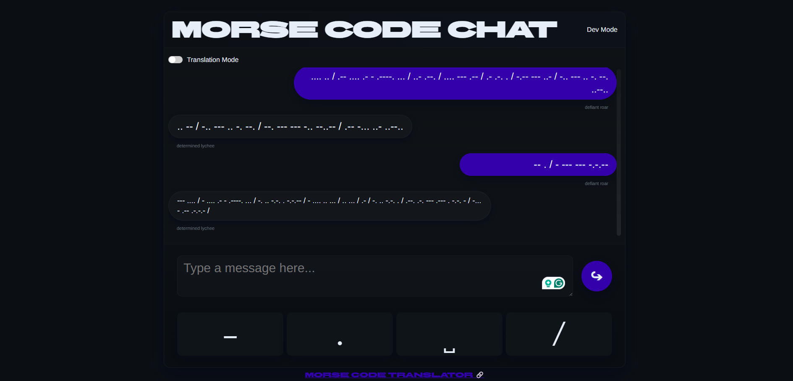

# Morse Code Chat



A real-time chat application with Morse code translation capabilities built with Flask and Socket.IO.

## Features

- Real-time chat messaging using WebSocket connections
- Morse code translation support
- Unique user identification with cookies
- Dynamic user display names generated from adjective-noun combinations
-  Morse code on-screen keyboard
- Toggle between Morse code and plain text display
- Dev Mode to hide identity into a new one for testing
- REST API endpoints for Morse code translation

## Tech Stack

- Backend: Python/Flask
- Real-time Communication: Socket.IO
- Frontend: JavaScript, HTML, CSS
- Additional Libraries: eventlet, python-dotenv

## Installation

1. Clone the repository:
```
git clone https://github.com/nirvaankohli/sketch-chat.git
cd sketch-chat
```

2. Install the required Python packages:
```
pip install -r requirements.txt
```

3. Create a `.env` file in the project root and add your secret key:
```
SECRET_KEY=your-secret-key-here
```

## Running the Application

1. Start the server:
```
python app.py
```

2. Open the link:
```
http://localhost:5000
```

## Supported Characters

The application supports the following characters for translation:
- Letters (a-z)
- Numbers (0-9)
- Special characters: . , ? / ' ! & -
- Space

[LICENSE](LICENSE) file for details.